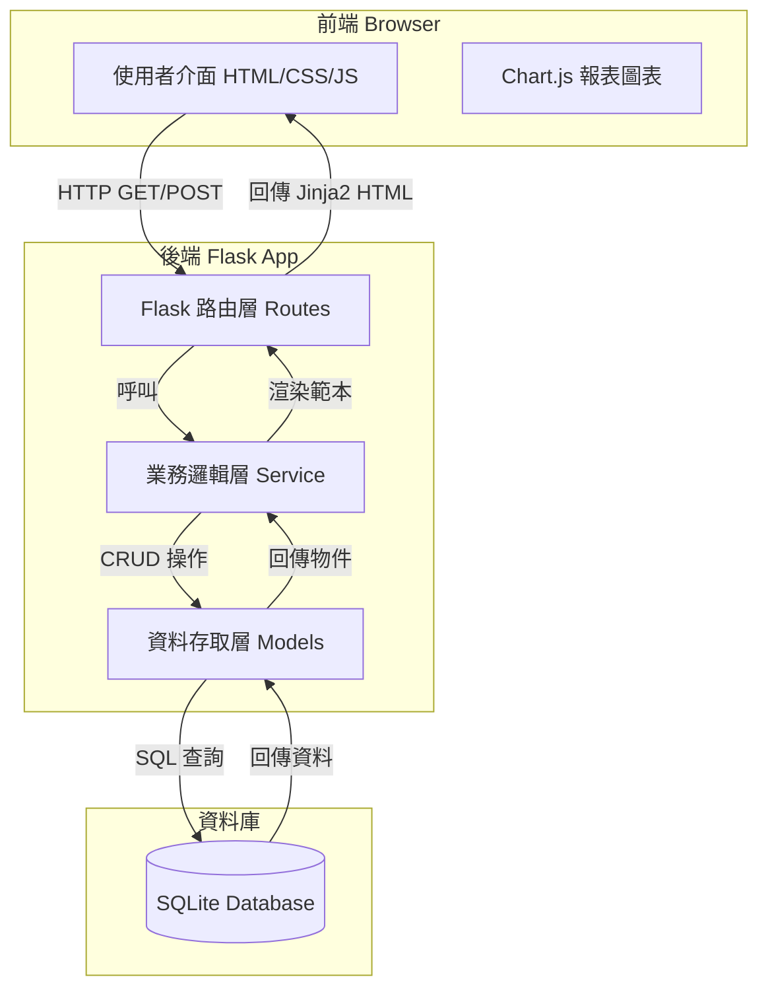

# 個人記帳系統 - 系統架構文件 (System Architecture)

## 1. 系統概述 (System Overview)
本系統為一款基於 Flask 與 SQLite 開發的個人專屬記帳應用程式。有別於傳統日曆月，本系統核心特色在於支援「自訂月起始日」（如發薪日），並提供高度客製化的收支分類管理，搭配直覺的報表（當下財務狀態與月末總結）以呈現真實的生活財務週期。

## 2. 系統架構圖 (Architecture Diagram)



## 3. 技術堆疊 (Technology Stack)
* **前端 (Frontend)**:
  * HTML5, CSS3, 原生 JavaScript
  * 樣式: 採用 Vanilla CSS 或現代化 CSS 框架 (由後續 UI 設計決定)，注重豐富視覺與動態互動
  * 模板引擎: Jinja2
  * 資料視覺化: Chart.js (用於財務報表圖表呈現)
* **後端 (Backend)**:
  * 語言: Python 3
  * 框架: Flask
  * 安全與擴充套件: Flask-WTF (表單驗證與 CSRF 防護)、Werkzeug (密碼雜湊)
* **資料庫 (Database)**:
  * SQLite (輕量級、無須獨立伺服器，適合單人專案)
  * 可使用原生的 `sqlite3` 或 `SQLAlchemy`，考量效能與簡潔度。

## 4. 模組與組件設計 (Module & Component Design)
系統將採用傳統的 MVC（Model-View-Controller）架構變體進行設計，透過清晰的層次劃分以利後續擴展與維護：

### 4.1 視圖與介面層 (View Layer - Jinja2 Templates)
* **Dashboard (儀表板)**: 呈現當下財務報表（自起始日至今日的累積收支、可用餘額）。
* **Transaction Forms (收支表單)**: 提供新增、修改、刪除收入與支出的介面。
* **Reports (月結報表)**: 依據自訂起始日呈現歷史各月份的總結與視覺化圖表。
* **Settings (設定頁面)**: 供使用者設定每月起始日及自訂收支分類。

### 4.2 控制與路由層 (Controller Layer - Flask Routes)
負責接收 HTTP Request，進行基本的參數檢查，並將邏輯委派給 Service 層。主要路由群組：
* `/` (首頁/儀表板)
* `/transactions` (收支管理 CRUD)
* `/reports` (月末/歷史報表檢視)
* `/settings` (系統起始日與分類設定)

### 4.3 業務邏輯層 (Service Layer)
處理系統核心邏輯，確保視圖與資料庫層解耦：
* **Date Range Calculator**: 核心服務。根據使用者的「自訂月起始日」及當前時間，動態計算並回傳真正的「財務月起訖日期」。
* **Financial Aggregator**: 將資料庫撈出的明細資料進行彙整與統計（如計算各分類佔比、總可用餘額）。

### 4.4 資料模型層 (Model Layer)
負責與 SQLite 資料庫溝通的模組：
* **Transaction Model**: 處理交易紀錄（包含金額、收支類型、分類、日期、備註等）。
* **Category Model**: 處理收支分類定義（包含預設與自訂分類）。
* **Setting Model**: 儲存全域設定（如：自訂月起始日）。

## 5. 資料流與系統流程 (Data Flow)
**以「新增一筆支出」為例**：
1. **Client**: 使用者於前端介面填寫金額、分類與日期，點擊送出 POST 請求。
2. **Router (Controller)**: 接收 `/transactions/add` 請求，進行表單與 CSRF 防護驗證。
3. **Service**: 驗證金額正確性及分類是否存在，並過濾可能引發 XSS/SQL Injection 的輸入。
4. **Model**: 執行寫入邏輯 `INSERT INTO transactions ...` 將資料存入 SQLite。
5. **Router (Controller)**: 寫入成功後，重新導向回首頁 (`/`)。
6. **Client**: 重新渲染 Dashboard 畫面，顯示更新後的餘額與最新明細。

## 6. 目錄結構規劃 (Directory Structure)
```text
web_app_development/
├── app.py              # Flask 應用程式入口點
├── config.py           # 設定檔 (Secret Key, DB 路徑設定)
├── requirements.txt    # 專案相依套件清單
├── models/             # 資料模型層 (DB Schema 與操作)
│   ├── __init__.py
│   ├── database.py     # SQLite 連線池/初始化
│   ├── models.py       # 收支、分類與設定 Model
├── services/           # 業務邏輯層
│   ├── __init__.py
│   └── finance.py      # 日期計算與統計邏輯
├── static/             # 靜態資源 (CSS/JS/Images)
│   ├── css/
│   │   └── style.css   # 全域與現代化樣式
│   └── js/
│       └── main.js     # 前端互動與 Chart.js 初始化
├── templates/          # Jinja2 模板
│   ├── base.html       # 共用母版 (Header, Sidebar)
│   ├── dashboard.html  # 儀表板
│   ├── transactions.html
│   ├── reports.html
│   └── settings.html
└── docs/               # 專案文件
    ├── PRD.md          # 產品需求文件
    └── Architecture.md # 系統架構文件 (本文件)
```
