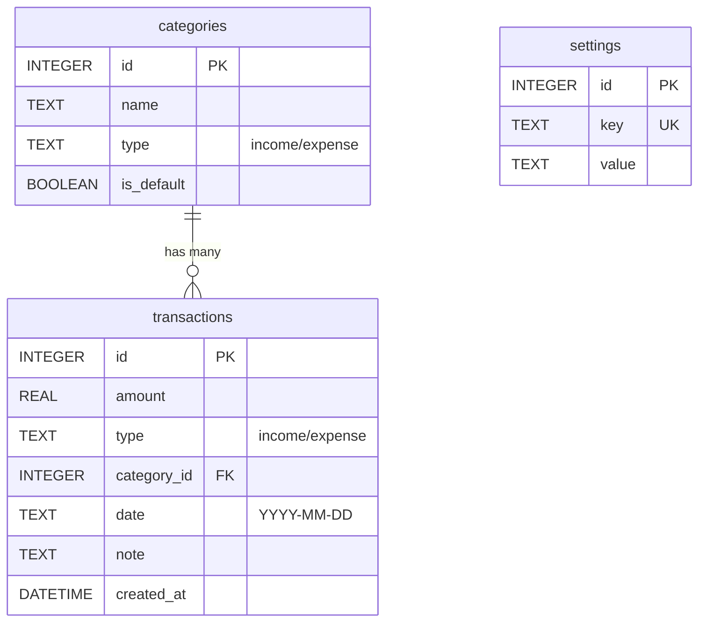

# 資料庫設計文件 (Database Design)

本文件依據 PRD 與架構文件，定義個人記帳系統的 SQLite 資料庫結構。

## 1. ER 圖 (實體關係圖)

## 2. 資料表詳細說明

### `categories` (收支分類表)
紀錄所有的收支分類，包含系統預設與使用者自訂。
- `id` (INTEGER, PK): 唯一識別碼，自動遞增。
- `name` (TEXT, 必填): 分類名稱，如「餐飲」、「薪水」。
- `type` (TEXT, 必填): 分類類型，只能是 'income' 或 'expense'。
- `is_default` (BOOLEAN, 預設 0): 標示是否為系統預設分類。預設分類不允許使用者刪除。

### `transactions` (交易紀錄表)
紀錄每一筆收入與支出的明細。
- `id` (INTEGER, PK): 唯一識別碼，自動遞增。
- `amount` (REAL, 必填): 交易金額，不可為負數。
- `type` (TEXT, 必填): 'income' 或 'expense'，雖可由分類推得，但為查詢效能直接儲存。
- `category_id` (INTEGER, 必填, FK): 關聯到 `categories.id`，表示該筆紀錄所屬的分類。
- `date` (TEXT, 必填): 交易發生的日期，格式為 YYYY-MM-DD，用於自訂月份統計。
- `note` (TEXT, 選填): 使用者自訂備註。
- `created_at` (DATETIME): 紀錄建立的時間戳記。

### `settings` (系統全域設定表)
採用 Key-Value 結構，方便未來擴充其他設定。
- `id` (INTEGER, PK): 唯一識別碼，自動遞增。
- `key` (TEXT, 必填, Unique): 設定鍵值，例如 `month_start_day`（自訂月起始日）。
- `value` (TEXT, 必填): 設定值，儲存為字串，由應用程式根據 Key 進行轉型處理。
