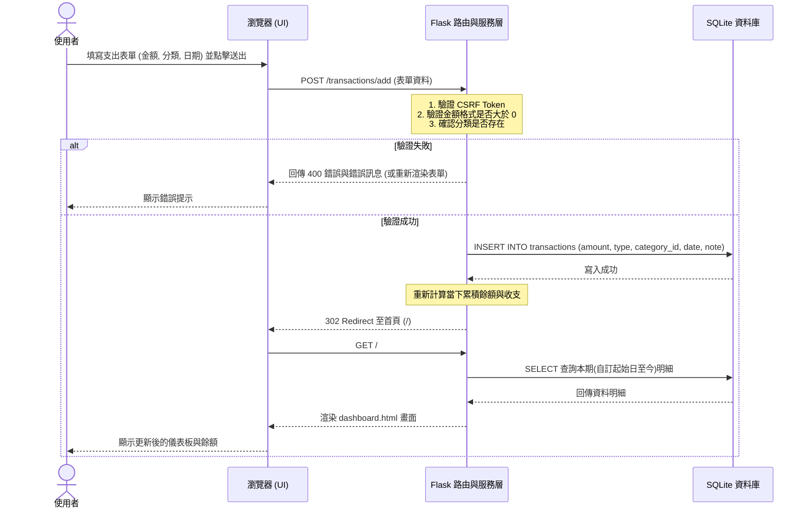

# 系統流程圖文件 (Flowcharts)

本文件依據 PRD 與架構文件，視覺化個人記帳系統的「使用者流程」與「系統內部資料流」。

## 1. 使用者流程圖 (User Flow)

此流程圖描述使用者從開啟應用程式後，可能進行的操作路徑與畫面跳轉。

```mermaid
flowchart LR
    Start([使用者開啟網頁]) --> Dashboard[首頁 - 儀表板 (Dashboard)]
    
    Dashboard --> ActionChoice{要執行什麼操作？}
    
    ActionChoice -->|查看當下狀態| ViewDash[檢視累積收支與餘額]
    ViewDash --> Dashboard
    
    ActionChoice -->|新增紀錄| AddTx[進入收支表單頁面]
    AddTx --> FillForm[填寫金額、日期與分類]
    FillForm --> SubmitTx{送出表單}
    SubmitTx -->|成功| Dashboard
    SubmitTx -->|失敗/錯誤| AddTx
    
    ActionChoice -->|檢視歷史| ViewReports[進入月結報表頁面]
    ViewReports --> ShowChart[查看圓餅圖與分類總結]
    ShowChart --> Dashboard
    
    ActionChoice -->|管理設定| GoSettings[進入設定頁面]
    GoSettings --> EditSettings[設定自訂起始日/編輯分類]
    EditSettings --> SaveSettings{儲存設定}
    SaveSettings -->|成功| Dashboard
```

## 2. 系統序列圖 (Sequence Diagram)

此序列圖以「使用者新增一筆支出紀錄」為例，描述前端到後端再到資料庫的完整互動歷程。



## 3. 功能清單對照表

以下統整所有主要功能的 URL 路徑與對應之 HTTP 方法：

| 功能模組 | 動作描述 | HTTP 方法 | URL 路徑 | 說明 |
| :--- | :--- | :---: | :--- | :--- |
| **Dashboard** | 檢視首頁與當下財務狀態 | `GET` | `/` | 系統預設首頁，顯示自訂起始日至今的概況 |
| **Transactions** | 進入新增收支頁面 | `GET` | `/transactions/add` | 顯示新增表單 |
| **Transactions** | 送出新增收支表單 | `POST` | `/transactions/add` | 將資料寫入資料庫 |
| **Transactions** | 進入編輯收支頁面 | `GET` | `/transactions/edit/<id>` | 顯示特定紀錄的編輯表單 |
| **Transactions** | 送出編輯收支表單 | `POST` | `/transactions/edit/<id>` | 更新資料庫中特定紀錄 |
| **Transactions** | 刪除收支紀錄 | `POST` | `/transactions/delete/<id>` | 軟刪除或硬刪除特定紀錄 |
| **Reports** | 檢視歷史月結報表 | `GET` | `/reports` | 顯示依據自訂起始日劃分的各月份報表與圖表 |
| **Settings** | 進入設定頁面 | `GET` | `/settings` | 顯示設定表單（起始日、分類列表） |
| **Settings** | 更新起始日與全域設定 | `POST` | `/settings/update` | 更新系統全域設定 |
| **Settings** | 新增/修改自訂分類 | `POST` | `/settings/categories` | 新增或編輯分類項目 |
| **Settings** | 刪除自訂分類 | `POST` | `/settings/categories/delete/<id>` | 刪除特定分類項目 |
